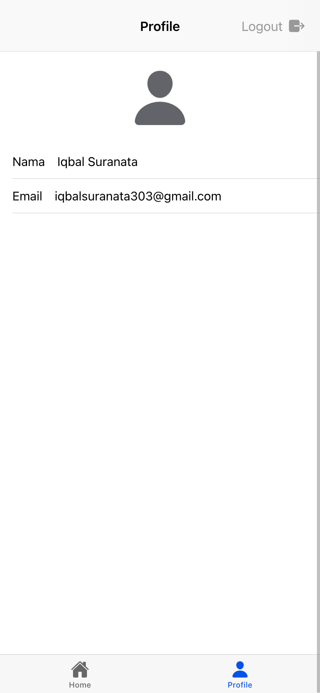

Proses autentikasi Google dimulai dengan inisialisasi plugin Capacitor Google Auth 
menggunakan `clientId` dari Google API Console. Aplikasi meminta ruang lingkup (scopes) 
seperti profil dan email pengguna untuk akses data tertentu. Setelah diinisialisasi, 
pengguna diminta login melalui **GoogleAuth.signIn()**, di mana mereka memasukkan kredensial akun Google. 
Plugin ini mengembalikan **idToken**, yaitu token autentikasi yang digunakan untuk verifikasi di Firebase.

Token tersebut diteruskan ke Firebase Authentication menggunakan `GoogleAuthProvider.credential(idToken)`. 
Firebase memverifikasi kredensial ini dan, jika valid, mengotentikasi pengguna. 
Data pengguna yang berhasil login, seperti nama, email, dan foto profil, tersedia dalam objek `user` 
yang dikembalikan oleh Firebase melalui properti `result.user`.

Firebase juga menyediakan **listener** `onAuthStateChanged` untuk mendeteksi perubahan status login. 
Listener ini memastikan informasi pengguna disimpan secara real-time saat login atau logout. 
Dengan autentikasi ini, aplikasi dapat dengan aman mengakses data profil pengguna yang telah diverifikasi 
melalui Firebase, mendukung pengalaman pengguna yang lancar dan aman.
