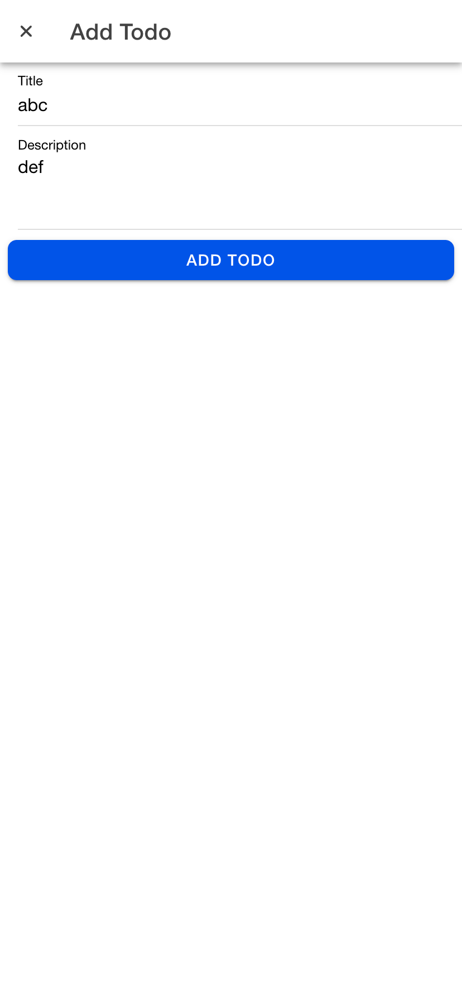

 Data todo dikelola dalam state todos, dengan operasi loadTodos memuat data dari layanan Firebase Firestore ke dalam aplikasi (Read).  Status tugas (aktif/selesai) dapat diubah menggunakan fungsi handleStatus, yang memperbarui properti status pada tugas (Update).

Tambahan tugas baru dilakukan melalui fungsi handleSubmit, yang menambahkan tugas pada Firestore pada status Create

Edit tugas dilakukan melalui fungsi handleSubmit, yang memperbarui tugas pada Firestore pada status Update

Proses slide ke kanan pada daftar tugas memunculkan opsi Edit dan Selesaikan Tugas, yang didefinisikan di `<ion-item-options side="end">`. Ketika opsi Edit diklik, fungsi `handleEdit(todo)` akan membuka modal untuk mengubah data tugas, sedangkan opsi Selesaikan Tugas memanggil fungsi `handleStatus(todo)` untuk mengubah status tugas menjadi selesai atau aktif. Setelah tindakan dilakukan, sliding item otomatis ditutup, status tugas diperbarui di Firestore, dan notifikasi muncul sebagai konfirmasi.

Fitur penghapusan tugas dilakukan melalui handleDelete, yang menghapus data dari Firestore (Delete).

