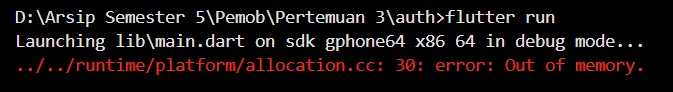
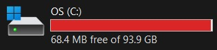

Maaf mas ini storage C saya penuh buat running emulatornya 
jadi tidak sempat screenshot aplikasinya dan tampilannya masih default

PENJELASAN
1. Route
initialRoute Mengatur halaman awal yang akan ditampilkan ketika aplikasi dibuka.
routes ialah daftar rute yang menghubungkan string (seperti /login, /profile) dengan widget (halaman) yang akan ditampilkan.

2. Side Menu
Drawer: Widget yang menciptakan menu samping.
ListTile: Elemen individual di dalam menu yang menavigasi ke halaman tertentu menggunakan Navigator.pushNamed.

3. Login Page
TextField Input field untuk username dan password.
ElevatedButton Tombol untuk memicu proses login.
Validasi login dilakukan dengan membandingkan input dengan data yang telah ditentukan (dalam hal ini 'atmin' dan 'atmin').

4. Local Storage
SharedPreferences ialah Library yang digunakan untuk menyimpan data sederhana secara lokal di perangkat pengguna.
setBool dan getBool ialah metode untuk menyimpan dan membaca nilai boolean (misalnya status login).
checkLoginStatus ialah fungsi yang memeriksa status login dan mengarahkan pengguna ke halaman utama jika sudah login sebelumnya.
