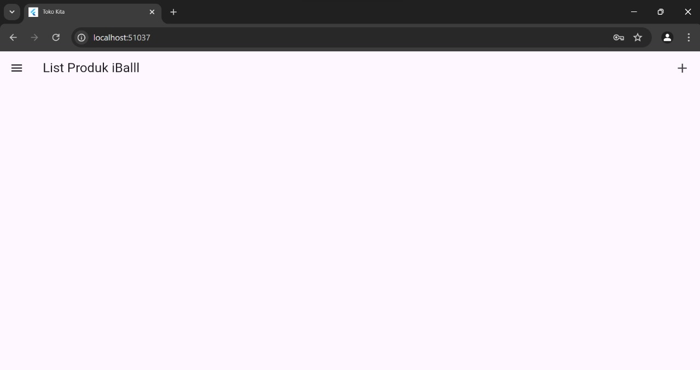
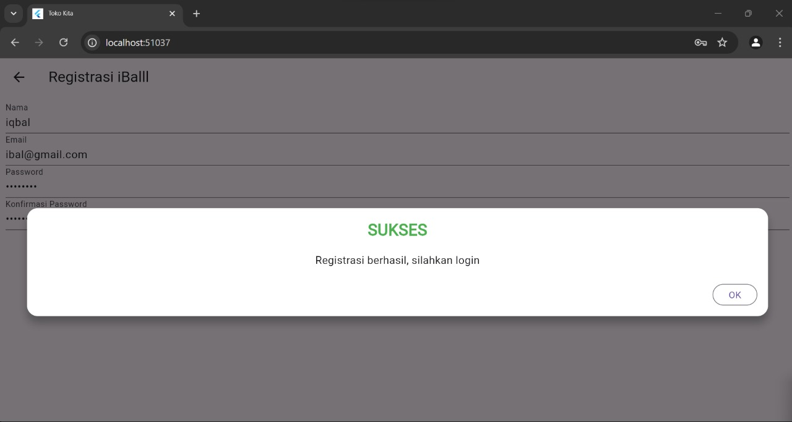
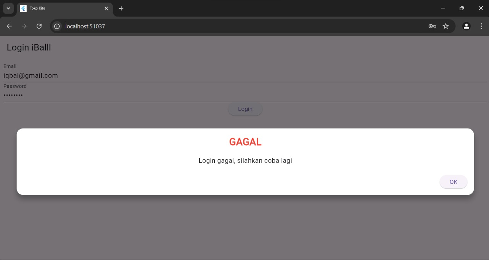
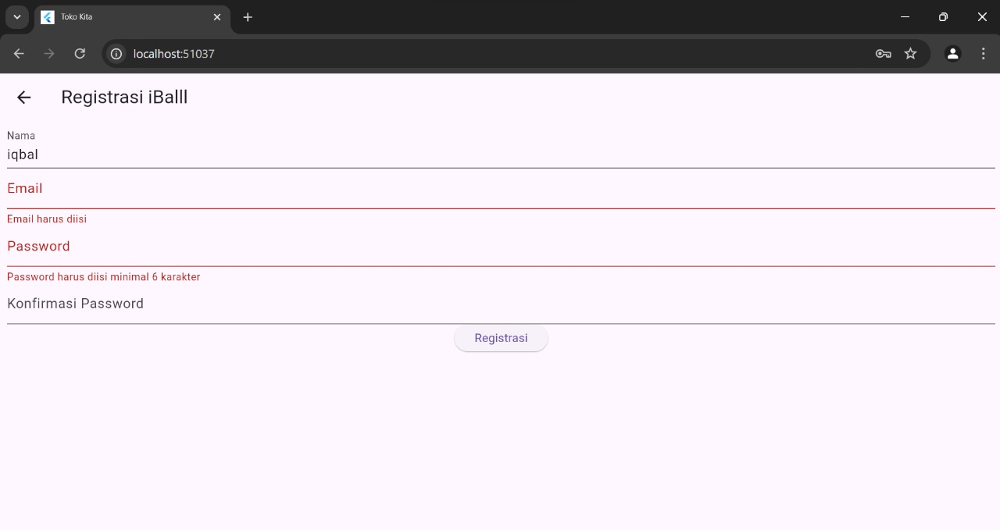
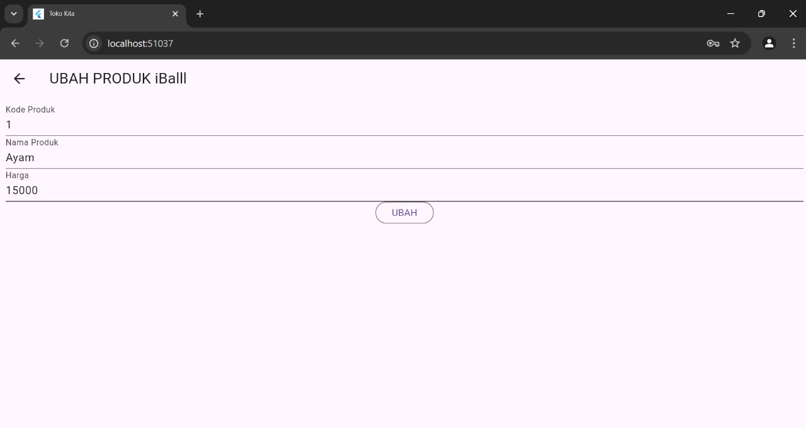
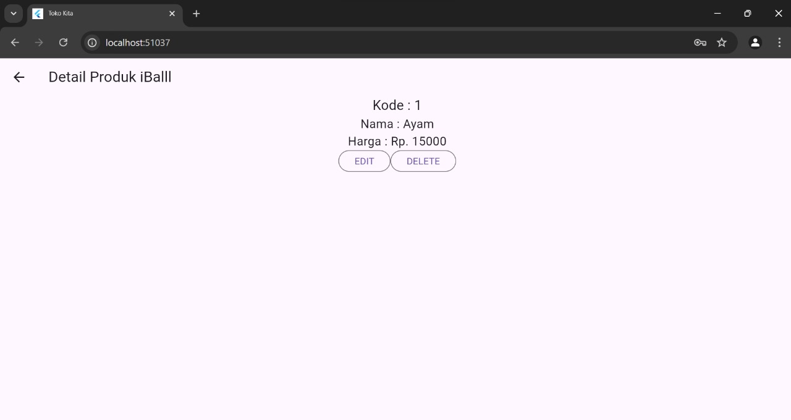
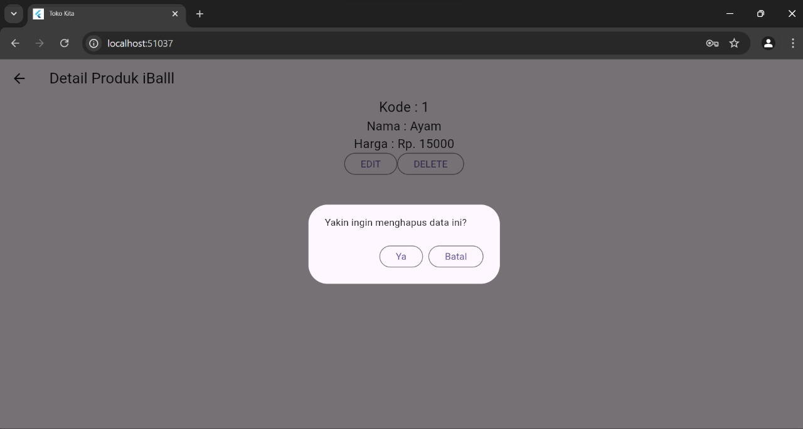
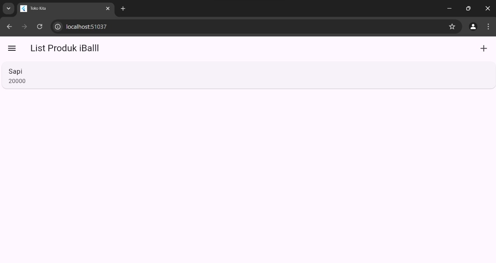

1. Proses Autentikasi
a. Register
    Proses registrasi di aplikasi ini dimulai ketika pengguna mengisi nama, email, password, dan konfirmasi password, lalu menekan tombol "Registrasi". Aplikasi akan memvalidasi input untuk memastikan nama minimal 3 karakter, email dalam format yang valid, password minimal 6 karakter, dan konfirmasi password harus sesuai dengan password yang dimasukkan. Jika validasi berhasil, data akan dikirim ke server melalui fungsi `RegistrasiBloc.registrasi()`. Jika registrasi sukses, aplikasi akan menampilkan dialog sukses yang meminta pengguna untuk login. Namun, jika gagal, dialog peringatan akan muncul untuk memberitahu pengguna bahwa registrasi tidak berhasil dan meminta mencoba lagi.

b. Login
    Proses login di aplikasi ini dimulai ketika pengguna memasukkan email dan password, lalu menekan tombol "Login". Aplikasi akan memvalidasi input tersebut dan mengirimkannya ke server melalui fungsi `LoginBloc.login()`. Jika respons server berhasil (kode 200), token dan user ID yang diterima akan disimpan menggunakan `UserInfo()`, dan pengguna akan diarahkan ke halaman produk (`ProdukPage`). Jika gagal, aplikasi menampilkan pesan peringatan yang memberitahukan bahwa login tidak berhasil dan meminta pengguna mencoba lagi.

c. Valid Login dan Register

d. Invalid Login dan Register

2. Proses CUD
a. Create
    Proses tambah data produk di aplikasi ini dimulai ketika pengguna mengisi form dengan kode produk, nama produk, dan harga produk, lalu menekan tombol "Simpan". Aplikasi akan memeriksa apakah semua kolom sudah diisi dengan benar, seperti memastikan harga tidak kosong dan formatnya benar. Setelah validasi, data produk yang diinput akan dikumpulkan dan dikirim ke server lewat fungsi `ProdukBloc.addProduk()`. Jika proses tambah produk berhasil, pengguna akan diarahkan kembali ke halaman daftar produk, tetapi jika ada masalah seperti koneksi atau server error, aplikasi akan menampilkan pesan peringatan agar pengguna mencoba lagi. Selama proses ini berlangsung, tombol akan dikunci sementara untuk mencegah pengiriman data berulang kali hingga proses selesai.
    

c. Update
    Proses update data produk di aplikasi ini dimulai ketika pengguna memilih produk yang ingin diubah, kemudian diarahkan ke halaman formulir dengan data produk yang sudah terisi. Pengguna dapat mengubah kode produk, nama produk, atau harga produk. Setelah itu, pengguna menekan tombol "Ubah". Aplikasi akan memvalidasi apakah semua kolom telah diisi dengan benar. Jika validasi berhasil, data baru dikirim ke server menggunakan fungsi `ProdukBloc.updateProduk()`. Jika proses update sukses, pengguna akan diarahkan kembali ke halaman daftar produk, namun jika terjadi kegagalan, aplikasi akan menampilkan pesan peringatan untuk mencoba lagi. Sementara itu, tombol dikunci agar tidak bisa ditekan berulang kali sampai proses selesai.
    

d. Delete
    Proses delete (penghapusan data produk)  dimulai ketika pengguna menekan tombol "DELETE" pada halaman detail produk. Setelah tombol ditekan, aplikasi akan menampilkan sebuah dialog konfirmasi yang menanyakan apakah pengguna yakin ingin menghapus produk tersebut. Jika pengguna menekan tombol "Ya" di dialog konfirmasi, maka fungsi `ProdukBloc.deleteProduk()` dipanggil dengan mengirimkan ID produk yang akan dihapus ke server. Jika proses penghapusan di server berhasil, pengguna akan diarahkan kembali ke halaman daftar produk (`ProdukPage`). Namun, jika proses gagal, aplikasi akan menampilkan WarningDialog yang berisi pesan bahwa penghapusan gagal dan menyarankan pengguna untuk mencoba lagi. Tombol "Batal" pada dialog memberikan opsi untuk membatalkan penghapusan dan menutup dialog tanpa melakukan tindakan apapun.
    
    

3. Proses Tampil Data (Read)
Proses membaca data produk dalam kode ini dilakukan dengan menggunakan `FutureBuilder` di dalam kelas `ProdukPage`. Di bagian body, `FutureBuilder` memanggil metode `getProduks()` dari `ProdukBloc` untuk mengambil data produk secara asynchronous. Jika ada kesalahan saat mengambil data, akan dicetak di konsol, dan jika data berhasil diambil, maka akan ditampilkan daftar produk dalam bentuk `ListProduk`. Di dalam `ListProduk`, setiap produk ditampilkan menggunakan `ListView.builder`, yang membuat item produk secara dinamis. Setiap item produk dapat ditekan, dan saat ditekan, aplikasi akan navigasi ke halaman `ProdukDetail` untuk menampilkan informasi lebih lanjut tentang produk yang dipilih. Dengan cara ini, pengguna bisa melihat daftar semua produk dan detailnya dengan mudah.

 