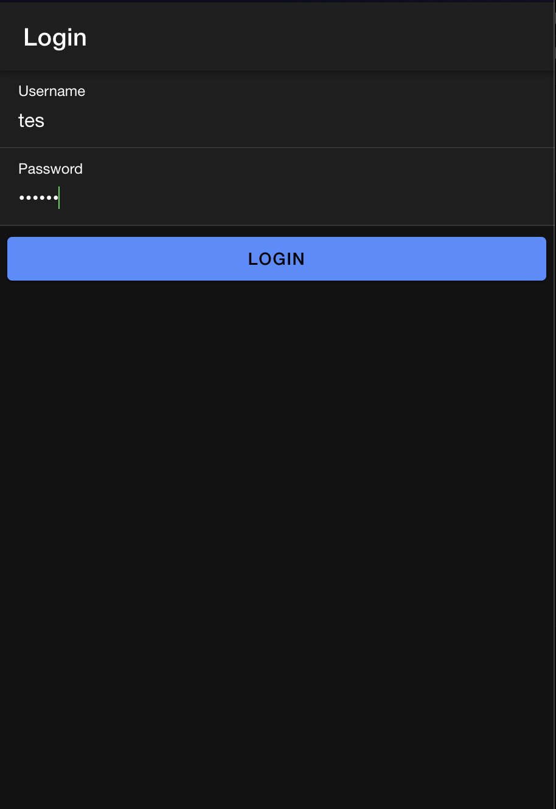
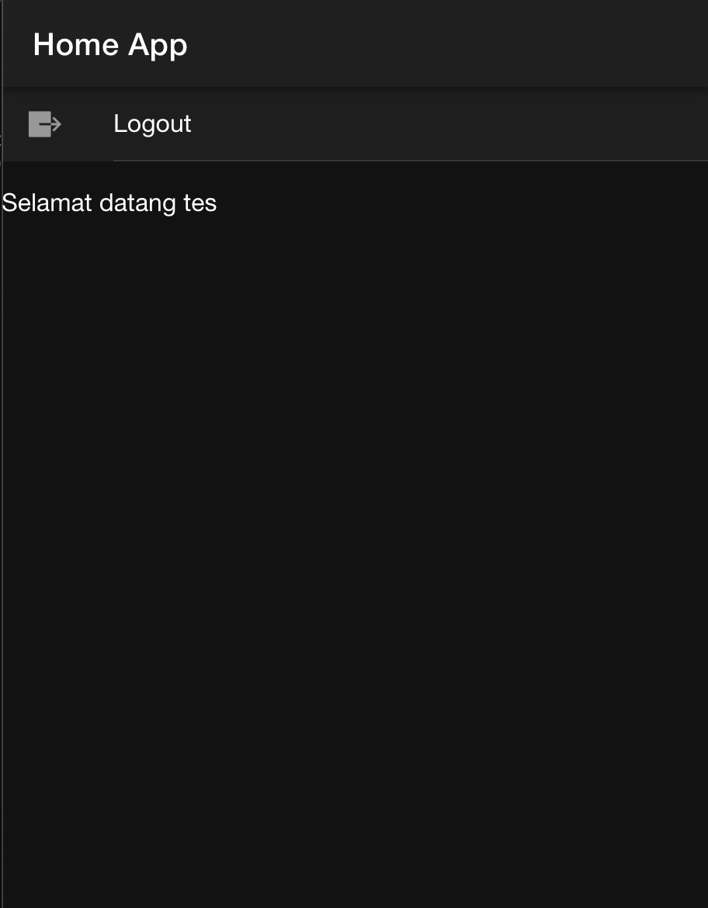

Saat pengguna memasukkan username dan password, 
fungsi login() pada login.page.ts memanggil postMethod dari AuthenticationService, 
mengirimkan data login ke API PHP login.php untuk diperiksa dalam database MySQL. 
Jika login berhasil, API mengembalikan status "berhasil" bersama token dan username, 
lalu disimpan dalam Preferences untuk menjaga status autentikasi. Setelah berhasil, 
pengguna diarahkan ke halaman home, di mana mereka disambut dengan nama pengguna yang disimpan di AuthenticationService. 
Fitur ini juga mencakup AuthGuard dan AutoLoginGuard untuk mengelola akses halaman: pengguna yang sudah masuk diarahkan ke /home, 
sementara yang belum diarahkan ke halaman login (/login). 
Selain itu, fungsi logout di halaman home memungkinkan pengguna keluar dengan menghapus data sesi dan kembali ke halaman login.

