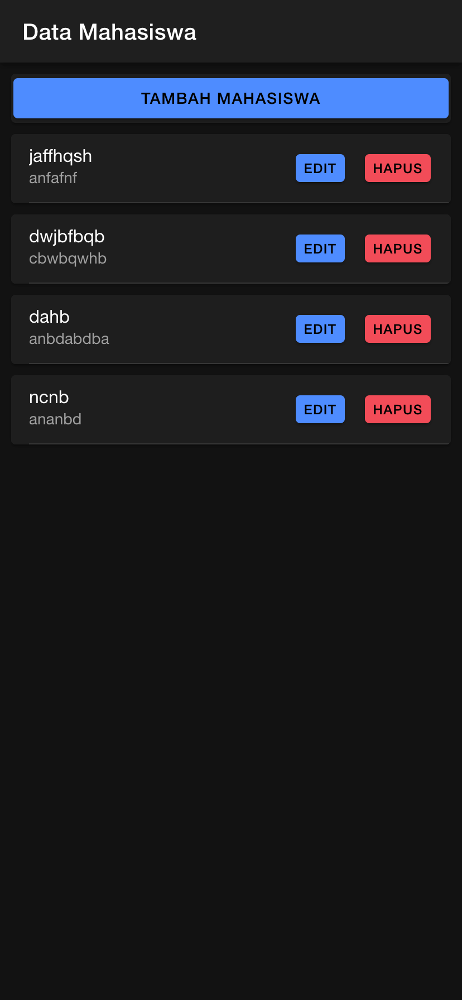
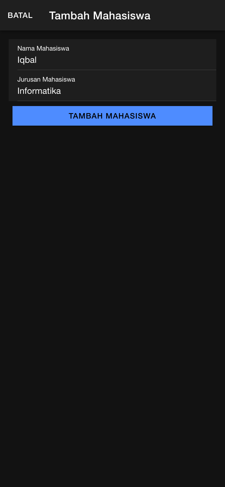
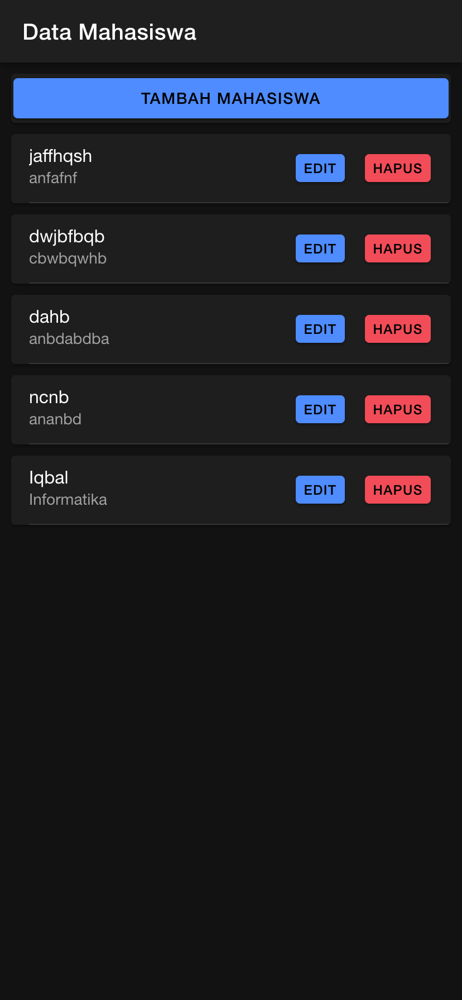
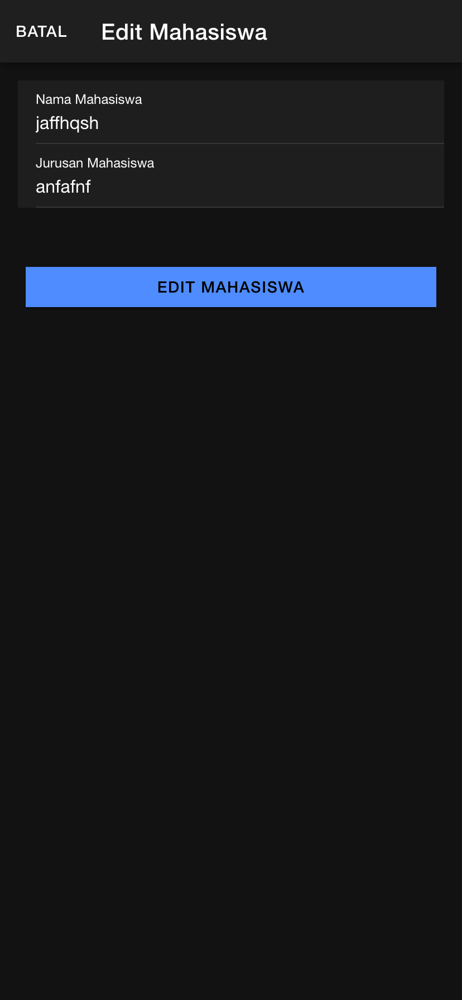
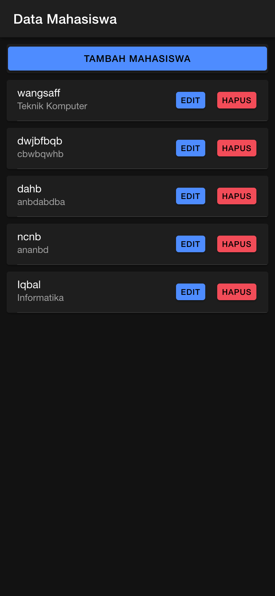
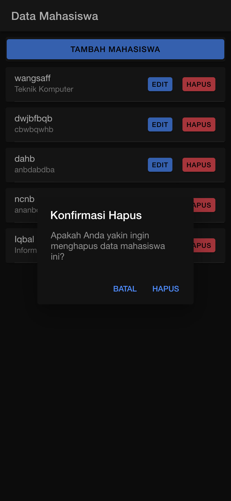
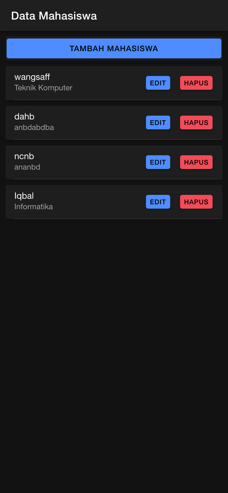

Penjelasan CRUD

READ

Fungsi getMahasiswa() digunakan untuk membaca dan menampilkan data mahasiswa dari server.
Menggunakan metode api.tampil('tampil.php') untuk mengambil data dari endpoint tampil.php.
Data yang diterima dari server disimpan dalam variabel dataMahasiswa, yang kemudian ditampilkan di halaman menggunakan perulangan *ngFor.

CREATE

Fungsi tambahMahasiswa() memungkinkan pengguna menambahkan data baru (nama dan jurusan) untuk mahasiswa.
Fungsi ini memeriksa apakah kolom nama dan jurusan sudah diisi.
Jika valid, data dikirim ke server menggunakan metode api.tambah(data, 'tambah.php').
Setelah berhasil, form di-reset dengan resetModal(), data mahasiswa diperbarui dengan memanggil getMahasiswa(), dan modal ditutup.

EDIT

Fungsi editMahasiswa() memungkinkan pengguna memperbarui informasi mahasiswa.
Pertama, openModalEdit() dipanggil untuk membuka modal edit dan memuat data mahasiswa yang ingin diubah menggunakan ambilMahasiswa().
Setelah data dimodifikasi, editMahasiswa() mengirim data terbaru ke server menggunakan metode api.edit(data, 'edit.php').
Jika berhasil, data di-refresh dengan getMahasiswa(), form di-reset, dan modal ditutup.

DELETE

Fungsi confirmDelete() memunculkan modal konfirmasi kepada pengguna untuk memastikan qbahwa ingin menghapus data.
Jika pengguna mengonfirmasi, hapusMahasiswa() dipanggil, yang mengirim permintaan penghapusan ke server dengan api.hapus(id, 'hapus.php?id=').
Jika penghapusan berhasil, data di-refresh menggunakan getMahasiswa() untuk memastikan data terbaru tampil di aplikasi.
